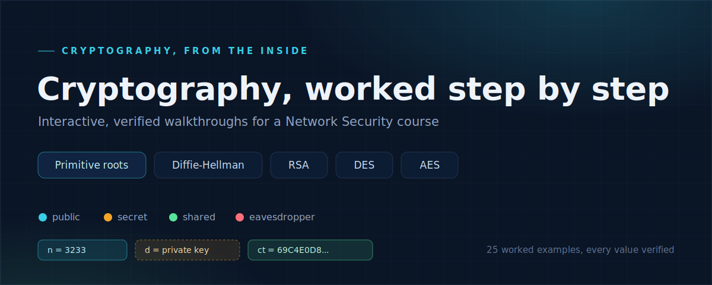

# Cryptography, worked step by step

A hands-on tool for seeing how five core pieces of cryptography actually work, one step at a time. There is nothing to install and no account to make. You open it in a web browser and click through real examples, watching every number appear as it is calculated.

**Open the walkthrough here:** <!-- your instructor will paste the class link on this line -->

If you were given a copy of the files instead of a link, just double-click `index.html` and it opens in your browser.

## What is inside

Five topics, each with five real worked examples that you step through:

- **Primitive roots.** The starting idea behind Diffie-Hellman: for a prime number, find the one special value whose powers cycle through every possible remainder.
- **Diffie-Hellman.** How two people who have never met can agree on a shared secret while everyone is listening.
- **RSA.** How a public key can lock a message that only the matching private key can open.
- **DES.** An older block cipher, shown here because it teaches the Feistel structure very clearly.
- **AES.** The block cipher in real use today, shown as its 4 by 4 grid of bytes moving through ten rounds.

## How to move around

- The **tabs** at the top choose the topic.
- The **row of chips** below the tabs chooses which example you are looking at (five per topic).
- The buttons at the bottom are **Next step**, **Back**, **Play** (which auto-advances), and **Reset**.
- The **numbered dots** are a timeline of the whole example. Click any dot to jump straight to that step.
- **Keyboard shortcuts:** right and left arrow keys move one step, the space bar plays or pauses, and the Home key jumps back to step 1.

A good rhythm: press **Play** once to watch the whole example flow past, then step through it slowly with the arrow keys to study each line.

## How to read the screen

### The colors mean something

Every value is colored by its role, and also carries a small text label so you never have to rely on color alone:

- **cyan is public:** anyone, including an attacker, is allowed to see it.
- **amber is secret:** it never leaves its owner.
- **mint is the payoff:** the shared secret both sides reach, or the message that gets recovered.
- **red is what the eavesdropper sees:** the values an outsider could capture off the wire.

### The explanation panel

The panel under the picture explains the current step. It shows the step title, the general formula, then the same formula with the real numbers filled in, a highlighted result, and a short plain-language reason for why this step works. Whenever a value comes from a large calculation, there is a link such as "Show how this is computed by hand" that you can expand to see the full working.

### Each topic has its own picture

- **Primitive roots** show a grid of all the possible remainders. As you test a candidate, the remainders its powers can reach light up. A value that fails lights only part of the grid; the true primitive root lights the whole grid. The small number in a cell's corner tells you which power of the candidate lands on that remainder.
- **Diffie-Hellman and RSA** show two people as cards on the left and right, a public channel between them, and Eve, the eavesdropper, underneath. Watch which values travel across the channel and which never leave a person's card.
- **DES and AES** show the plaintext block and the key at the top, a strip of the cipher's stages with the current stage highlighted, and a live view of the block as it changes (two halves for DES, a grid of bytes for AES). Expandable tables let you see all the round keys and the state after every single round.

## A good order to learn in

Go left to right: primitive roots, then Diffie-Hellman, then RSA, then DES, then AES. Primitive roots set up the idea that Diffie-Hellman needs, RSA is the other classic public-key method, and DES then AES move you into the symmetric block ciphers.

## What to take away from each section

- **Primitive roots:** what it means for one number to generate a whole group, and why only some values qualify.
- **Diffie-Hellman:** how both sides compute the same secret by different routes, and why the listener cannot.
- **RSA:** why the public and private keys fit together, and that decrypting returns the exact original message.
- **DES:** the Feistel round, and how repeating a simple round many times spreads one bit across the whole block.
- **AES:** the four operations in a round (substitute, shift, mix, add key) and how the block is treated as a grid of bytes.

## Try these

- In RSA, switch to a different example and, before stepping to the end, predict the ciphertext, then check yourself.
- In the primitive roots tab, pick a value that is not a primitive root and guess how many remainders it will reach before you step through it.
- Trace one AES round on paper for the first example, then compare against the expandable round table.
- Explain in one sentence why the two Diffie-Hellman parties end up with the same number.

## Good to know

- Nothing to install. It runs in any modern web browser, on a laptop or a phone.
- The examples use small numbers on purpose so you can check the arithmetic by hand. Real keys use the same math with numbers hundreds of digits long, and that size is the whole defense.
- These show the core algorithms only. Real systems wrap them in a mode of operation and add padding, which you will meet later in the course. Diffie-Hellman in practice also needs authentication to stop a middleman.
- DES is included to teach structure. Its key is too short to be safe today and it should not be used to protect real data.
- It works offline as well. Without an internet connection the fonts may look a little different, but everything still works.

---

Setup, hosting, and how the numbers are verified are in [SETUP.md](SETUP.md).
